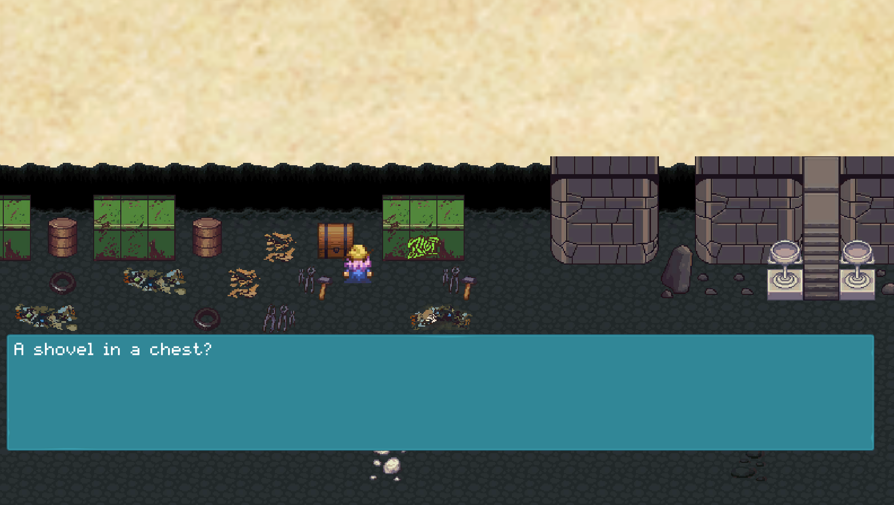

Source: <a href="https://github.com/tevintsales/Extra-Credits-Game-Jam-5">Escape from the Book Of Chickens</a>
Source: <a href="https://wungsoo.itch.io/escape-from-the-book-of-chickens">Download the game from Itch.io</a>

Development Tools:
Game was created using the game engine Unity.
All code was written in C#.
My main focus in this project was to write code to allow easy functionality for creating events in the game that could be used across
all of the scenes such as text and item interactions.

This totals to roughly 75 percent of the code.

Extra Credits hosted it's 5th Game Jam and I gathered a small team of three to create a game.

This a a 2D Puzzle RPG inspired by old RPG titles.

The premise of the story is that you are a mage that got trapped in a magic book that you came across while browsing the archives. The title of this book is none other than the "Book of Chickens".

Throughout this game, you will need to figure out how to solve the mysteries of the pages throughout this book. However, there is little to no directions on how to go about doing this.

There are various secrets hidden throughout the game, and there is also a secret room to enter for those who are willing to look for the Easter Eggs hidden throughout the game. 

  

