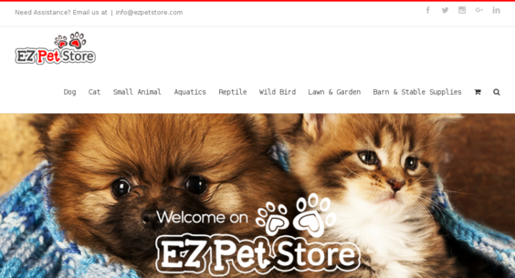

  This is a website that I helped a friend set up on his WordPress. The website is a pet food and toy store that takes its products from a 3rd party seller. The seller has a csv file that includes all the necessary info to get the products to display on WordPress.

  For this project, I did not create the site. The site design was already made. What was required of me was to change the store supplier that my friend had used. I had to get a new csv file, upload the file to WordPress and create products for all them using the data. I also set up the top menu on the pages, changed what the front page looks like, and set up any connecting pages that my friend had specified. There were times when I had to update the cPanel database using SQL statements to get rid of older products from the previous supplier.

  Through this project I got to get hands on experience of HTML, CSS, and Javscript code in a real world environment. I also learned how to effectively communicate with another person to make a website exactly how they wanted. To make sure there is no ambiguity between what is desired and what is designed, it is vital to learn how to understand what the client wants and translate that into code and development.

You can visit the site at [ezPetStore.com](http://www.ezpetstore.com/).

