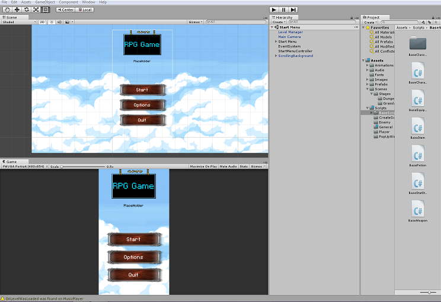

  

Source: <a href="https://github.com/tevintsales/MyUnityGame"><i class="large github icon "></i>tevintsales/MyUnityGame</a>

This package is an export of a project I created in the Unity Game engine. It is configured for most modern smartphones on the Android OS.

It contains a splash screen which loads all music and level management in the game. The menu system consists of a small network of connecting scenes in Unity as well as a working volume changer in the opitons scene. A lot of the work is compiled on my own after taking a course on [Udemy](https://www.udemy.com/unitycourse/) for Unity game creation.

From this project I learned about creating an mobile game application optimized for several screen sizes on a fixed portait orientation. I also learned how to connect and export those files to a phone for testing and debugging. The game I have been trying to make with it isn't functional, however the connecting menu system allows me to start the game up with no problems.
 
