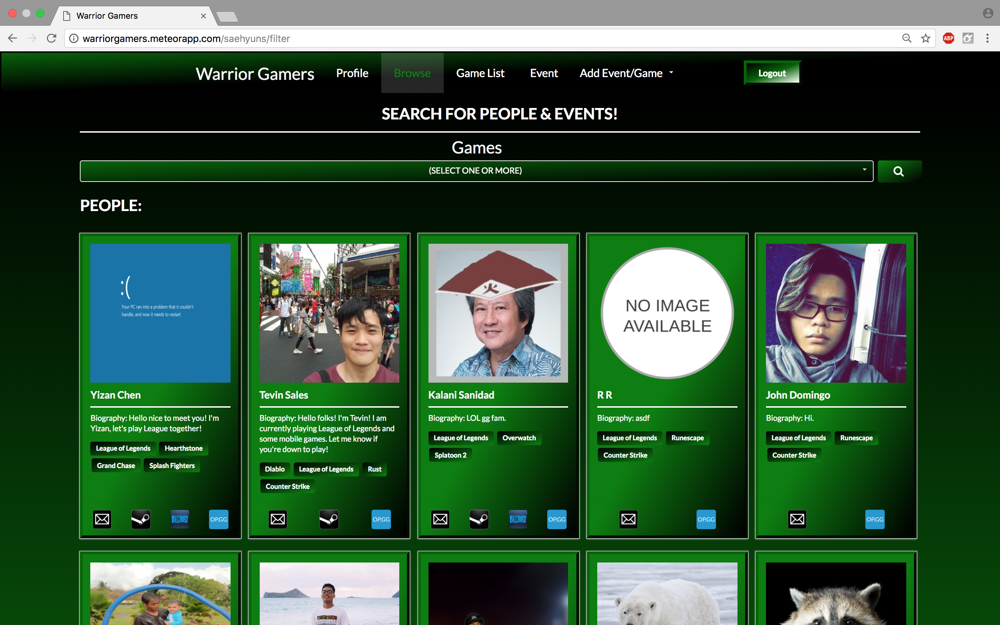

  

Source: <a href="https://314gb.github.io/">Warrior Gamers</a>

Video games are a huge part of modern day life, especially when majoring in computer science. There are hundreds
of multiplayer games that people play by themselves because they have no one to play with. Our web application,
Warrior Gamers, aims to fix that issue. By logging in with a student account one can find other students at the University
of Hawaii to enjoy games with. You can find people with the games you play as a search criteria. You can also find
events around the school that others have set up. If you don't find your game or would like to create an event for
people to join you can easily do so with our application.

The project has been made in the Meteor development environment along with the use of JavaScript, Semantic UI,
and various other software. By working in a team of four made up of hardworking and like-minded classmates we
have developed something pretty amazing given the time we had to create this project. My major contributions to
this project involved a lot of backend work. I created a lot of collections on the server site of Meteor and linked
them up to forms so that we can use user-inputted data for our site. I also had given a small hand with the front end work.
The color scheme of most pages were implemented by me with having some of my teammates give opinions and minor fixes
here and there.

Through this project I have learned a lot. Working in a team is a great and effective way to produce a project that would
ordinarily take a long time to finish by yourself. This project also opened my eyes and gave me a better idea of what the world
of software engineering looks like. Even if it may not be possible at the moment, because of this class, I feel like I'd love to
become a software engineer some day and will continue developing my skills until that time comes.

  

